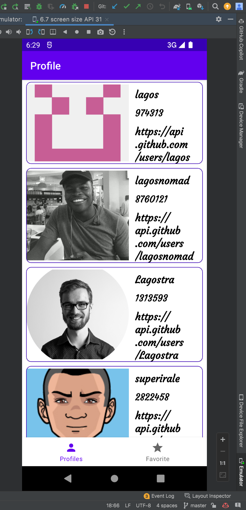
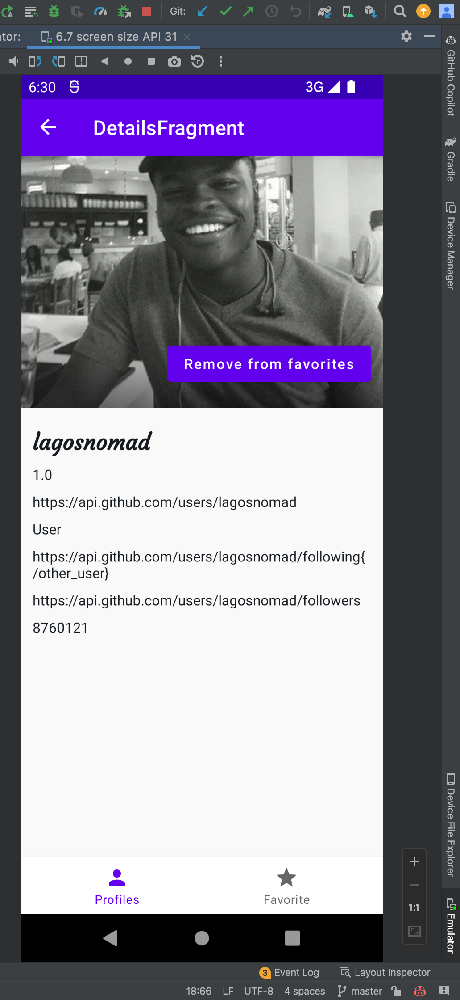
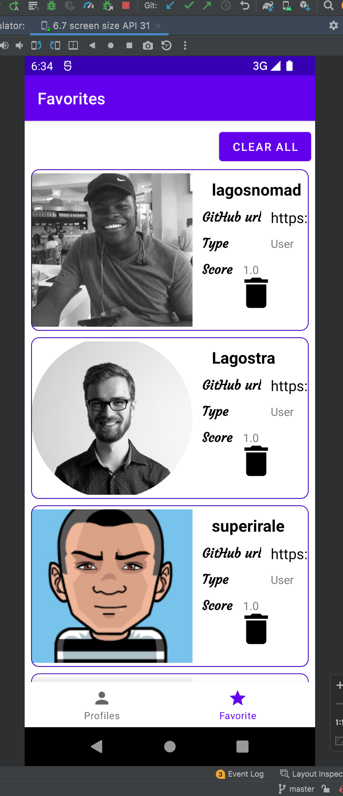

# OZ-Assessment task

## Development

## Technologies used

- [Dagger Hilt](https://dagger.dev/hilt/)
- [JetPack Databinding](https://developer.android.com/topic/libraries/data-binding)
- [Jetpack ViewBinding](https://developer.android.com/topic/libraries/view-binding)
- [Jetpack LiveData](https://developer.android.com/topic/libraries/architecture/livedata)
- [JetPack Navigation Components](https://developer.android.com/guide/navigation/navigation-getting-started)
- [Kotlin](https://kotlinlang.org/)
- [Rx java](https://reactivex.io/intro.html)
- [Jetpack paging3](https://developer.android.com/topic/libraries/architecture/paging/v3-overview)
- [Retrofit](https://square.github.io/retrofit/)
- [Room Database](https://developer.android.com/training/data-storage/room)
- [Coil](https://github.com/coil-kt/coil)
- [Facebook Shimmer Recyclerview](https://velmurugan-murugesan.medium.com/shimmer-effect-for-android-recyclerview-example-a9315b46cdc0)
- And many more

 main page

